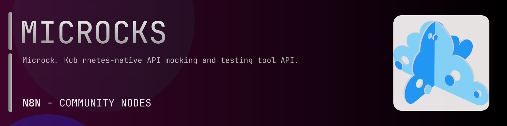

# @n8n-dev/n8n-nodes-microcks



[](https://www.npmjs.com/package/@n8n-dev/n8n-nodes-microcks)
[](https://opensource.org/licenses/MIT)

---

**Stop writing microcks API integrations by hand.**

Every time you connect n8n to microcks, you waste hours mapping endpoints, defining parameters, and debugging schemas. You copy-paste from docs, fix edge cases, and pray nothing breaks.

**What if connecting n8n to microcks took 5 minutes, not half a day?**

This node gives you **6+ resources** out of the box: **Mock**, **Test**, **Job**, **Config**, **Metrics**, and 1 more: with full CRUD operations, typed parameters, and zero manual configuration.

---

## What You Get

- **Zero boilerplate**: Resources, operations, and fields are pre-configured and ready to use
- **Full CRUD**: Create, read, update, and delete support where the API allows it
- **Typed parameters**: No more guessing field types
- **Built-in auth**: API key authentication, ready to go
- **Declarative**: Native n8n performance, no custom execute() overhead

---

## Install

```bash
npm install @n8n-dev/n8n-nodes-microcks
```

**Or in n8n:**
1. **Settings → Community Nodes → Install**
2. Search: `@n8n-dev/n8n-nodes-microcks`
3. Click **Install**

---

## Quick Start

1. Install the node (above)
2. Add credentials: **microcks API** → paste your API key
3. Drag the **microcks** node into your workflow
4. Pick a resource → pick an operation → done.

That's it. No configuration files. No code. It just works.

---

## Resources

<details>
<summary><b>Mock</b> (10 operations)</summary>

- Get Export a snapshot
- Post Import a snapshot
- Get Services and APIs
- Get the Services counter
- Get the already used labels for Services
- Get Search for Services and APIs
- Delete Service
- Get Service
- Put Update Service Metadata
- Put Override Service Operation

</details>

<details>
<summary><b>Test</b> (7 operations)</summary>

- Post Create a new Test
- Get TestResults by Service
- Get the TestResults for Service counter
- Get TestResult
- Get events for TestCase
- Get messages for TestCase
- Post Report and create a new TestCaseResult

</details>

<details>
<summary><b>Job</b> (10 operations)</summary>

- Post Upload an artifact
- Get ImportJobs
- Post Create ImportJob
- Get the ImportJobs counter
- Delete ImportJob
- Get ImportJob
- Post Update ImportJob
- Put Activate an ImportJob
- Put Start an ImportJob
- Put Stop an ImportJob

</details>

<details>
<summary><b>Config</b> (8 operations)</summary>

- Get features configuration
- Get authentification configuration
- Get Secrets
- Post Create a new Secret
- Get the Secrets counter
- Delete Secret
- Get Secret
- Put Update Secret

</details>

<details>
<summary><b>Metrics</b> (7 operations)</summary>

- Get aggregation of conformance metrics
- Get conformance metrics for a Service
- Get aggregated invocation statistics for a day
- Get aggregated invocations statistics for latest days
- Get top invocation statistics for a day
- Get invocation statistics for Service
- Get latest tests results

</details>

<details>
<summary><b>Default</b> (2 operations)</summary>

- Get Resources by Service
- Get Resource

</details>

---

## Why This Node?

**Without this node:**
- Hours of manual API integration
- Copy-pasting from microcks docs
- Debugging auth, pagination, error handling
- Maintaining your own client code

**With this node:**
- Install → configure → use. 5 minutes.
- Auto-generated from the official microcks OpenAPI spec
- Always up to date when the API changes
- Native n8n performance

---

## Auto-Generated
This node was auto-generated from the official **microcks** OpenAPI specification using
[@n8n-dev/n8n-openapi-node-ultimate](https://github.com/kelvinzer0/n8n-openapi-node-ultimate),
then validated against the live API so you get accurate types and real parameters, not guesswork.

When the microcks API updates, this node updates too.

---


## License

MIT © [kelvinzer0](https://github.com/n8n-code)
